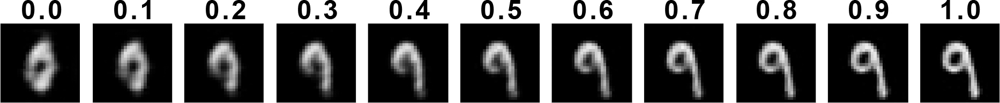

<h1 style="text-align: center;">Capsule Network<br/>Knowledge Extractor</h1>

<p style="text-align: center;">My Bachelor's Thesis. <i>Capsule Network Knowledge Extractor</i> is a software to easily produce <b>network visualizations</b> of a Capsule Network created with <b>Keras under TensorFlow 2.0</b>.</p>


## Running Locally
The project requires **Python 3** installed on your system. Install the dependencies:
```
pip3 install -r requirements.txt
```

Run a local server:
```
python3 run.py
```

Finally, navigate to [127.0.0.1:5000](https://127.0.0.1:5000) to use the software.

Additionally, you can edit the Capsule Network model or re-train the current one. For more informations about that, please check [`./capsnet_trainer/`](capsnet_trainer).

## Visualization Techniques

<div style="text-align: center;">
    
    <p><i>Convolutional layer's feature maps.</i></p>
</div>

<hr>

<div style="text-align: center;">
    
    <p><i>Primary Capsules' entities localization.</i></p>
</div>

<hr>

<div style="text-align: center;">
    
    <p><i>Improved Routing Path Visualization Technique.</i></p>
</div>

<hr>

<div style="text-align: center;">
    
    
    <p><i>Dense Capsules' magnitude and dimensions manipulated and visualized through the Decoder.</i></p>
</div>

<hr>

<div style="text-align: center;">
    
    <p><i>Area of interests produced by Grad-CAM++.</i></p>
</div>

### Thesis
You can *download or view* the .pdf file of the thesis [here](./thesis/CNKE_Thesis.pdf). Please note that this file will never be updated, nor the latex files will be shared.

### License
This project is licensed under the **MIT License** - see the [LICENSE](LICENSE) file for details.